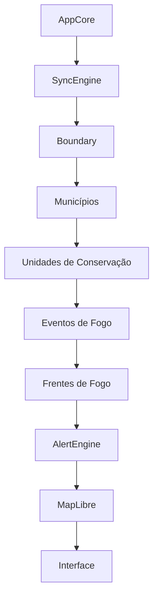

# 🔥 GeoFogo Ceará

<p align="center">
  
</p>

<p align="center">

Sistema Inteligente para Monitoramento de Incêndios Florestais do Estado do Ceará

</p>

<p align="center">

Monitoramento • Alertas • Operação em Campo • Funcionamento Offline • PWA

</p>

---

## 📖 Sobre o Projeto

O **GeoFogo Ceará** é um sistema de monitoramento geoespacial desenvolvido para apoiar ações de prevenção, monitoramento e resposta a incêndios florestais no Estado do Ceará.

A aplicação integra informações geográficas provenientes de diferentes fontes oficiais, permitindo visualizar em um único mapa:

- eventos ativos de fogo;
- frentes de propagação;
- áreas sensíveis;
- municípios;
- companhias do Corpo de Bombeiros Militar do Ceará;
- condições meteorológicas;
- alertas automáticos por proximidade.

O projeto foi concebido para funcionar tanto em ambiente operainterno quanto em campo, permitindo sua utilização mesmo em locais sem acesso contínuo à internet.

---

# 🎯 Objetivos

O GeoFogo Ceará possui cinco objetivos principais:

- fornecer uma visão operacional unificada dos eventos de fogo;
- reduzir o tempo necessário para identificar áreas prioritárias;
- aumentar a consciência situacional das equipes em campo;
- funcionar mesmo em ambientes com conectividade limitada;
- servir como plataforma aberta para evolução futura.

---

# ✨ Principais funcionalidades

## 🛰️ Monitoramento em tempo real

Visualização automática dos eventos de fogo disponibilizados pelo SIPAM.

---

## 🔥 Frentes de fogo

Exibição das frentes detectadas pelos satélites.

---

## 🏞️ Áreas Sensíveis

Visualização de áreas de maior potencial de risco.

---

## 🗺️ Municípios

Limites municipais do Estado do Ceará.

---

## 🚒 Companhias do Corpo de Bombeiros

Localização das unidades operacionais.

---

## ⚠ Alertas automáticos

Identificação automática de eventos de fogo próximos às áreas sensíveis.

A distância de alerta pode ser configurada pelo usuário.

---

## 🌦 Informações meteorológicas

Exibição das condições atuais de tempo.

---

## 📍 Modo Campo

Registro de:

- trilhas
- pontos
- observações

diretamente pelo dispositivo móvel.

---

## 💾 Funcionamento Offline

O sistema armazena localmente:

- limite do Ceará;
- municípios;
- unidades de conservação;
- eventos sincronizados;
- configurações.

---

## 📊 Diagnóstico Integrado

Painel interno para inspeção do estado da aplicação.

Permite verificar:

- sincronização;
- renderização;
- camadas;
- fontes de dados;
- erros registrados;
- funcionamento do mapa.

---

# 🏗 Arquitetura Geral

O GeoFogo Ceará foi desenvolvido utilizando uma arquitetura modular.

```text
                 AppCore
                     │
      ┌──────────────┼──────────────┐
      │              │              │
 SyncEngine     LayerManager   AlertEngine
      │              │              │
      │              │              │
 IndexedDB      MapLibre GL     Notifications
      │
      │
 Serviços Externos
      │
 ┌────┴──────────────────────────────────┐
 │                                       │
 SIPAM                            OpenWeather
```

Cada módulo possui responsabilidades bem definidas, facilitando manutenção e evolução do projeto.

---

# 🚀 Fluxo de Inicialização

Durante uma inicialização completa ("Cold Start"), o sistema executa as seguintes etapas:

```text
Inicialização

        │

        ▼

AppCore

        │

        ▼

MapLibre

        │

        ▼

LayerRegistry

        │

        ▼

Boundary do Ceará

        │

        ▼

Municípios

        │

        ▼

Unidades de Conservação

        │

        ▼

Eventos do SIPAM

        │

        ▼

Frentes de fogo

        │

        ▼

Alertas

        │

        ▼

Renderização

        │

        ▼

Aplicação pronta
```

---

# 🧩 Tecnologias Utilizadas

| Tecnologia | Finalidade |
|------------|------------|
| React | Interface da aplicação |
| Vite | Build e desenvolvimento |
| JavaScript ES2023 | Linguagem principal |
| MapLibre GL JS | Motor cartográfico |
| Tailwind CSS | Interface |
| Lucide Icons | Ícones |
| IndexedDB | Persistência Offline |
| Service Worker | Cache Offline |
| PWA | Instalação no dispositivo |
| Capacitor | Empacotamento Android |
| Git | Controle de versão |
| GitHub | Repositório |

---

# 🌐 Fontes Oficiais dos Dados

O GeoFogo Ceará utiliza exclusivamente dados provenientes de fontes oficiais ou amplamente reconhecidas pela comunidade geoespacial.

## 🛰 SIPAM — Sistema de Proteção da Amazônia

Utilizado para obtenção de:

- Eventos de fogo
- Frentes de fogo

Tecnologia utilizada:

- OGC Web Feature Service (WFS)

Camadas atualmente utilizadas:

```text
painel_do_fogo:mv_evento_filtro

painel_do_fogo:mv_frente_deteccao
```

Referências:

- Painel do Fogo – SIPAM
- Serviços OGC/WFS disponibilizados pelo SIPAM

---

## 🌦 OpenWeather

Utilizado para:

- temperatura;
- umidade;
- velocidade do vento;
- condições meteorológicas;
- previsão.

API utilizada:

Current Weather API

Documentação oficial:

https://openweathermap.org/api

---

## 🗺 Instituto Brasileiro de Geografia e Estatística (IBGE)

Utilizado para:

- limites municipais;
- divisão administrativa.

Referências:

https://www.ibge.gov.br/

https://www.ibge.gov.br/geociencias

---

## 🌳 ICMBio

Utilizado para:

- Unidades de Conservação Federais.

Referência:

https://www.gov.br/icmbio

---

## 🌿 SEMA Ceará

Utilizado para:

- Unidades de Conservação Estaduais.

Referência:

https://www.sema.ce.gov.br/

---

## 🗺 OpenStreetMap

Utilizado como mapa base.

Licença:

Open Database License (ODbL)

https://www.openstreetmap.org

---

## 🗺 MapLibre

Motor cartográfico utilizado pela aplicação.

https://maplibre.org/

---

## 📦 Capacitor

Responsável pela geração da aplicação Android.

https://capacitorjs.com/

---

## 💾 IndexedDB

Persistência local dos dados sincronizados.

Padrão implementado pelos navegadores modernos.

---

# 📂 Estrutura do Projeto

A aplicação foi organizada de forma modular para facilitar manutenção, testes e futuras expansões.

```text
geofogo-ceara
│
├── public/                     # Arquivos públicos (manifest, ícones, etc.)
│
├── src/
│   │
│   ├── alerts/                 # Motor de alertas geográficos
│   │
│   ├── components/             # Componentes React
│   │   ├── debug/
│   │   ├── layout/
│   │   ├── map/
│   │   ├── panels/
│   │   └── ui/
│   │
│   ├── core/                   # Núcleo da aplicação
│   │   ├── AppCore.js
│   │   ├── ErrorManager.js
│   │   ├── EventBus.js
│   │   └── config.js
│   │
│   ├── field/                  # Funcionalidades do Modo Campo
│   │
│   ├── hooks/                  # Hooks React
│   │
│   ├── layers/                 # LayerManager e definições das camadas
│   │
│   ├── map/                    # Integração com MapLibre
│   │
│   ├── services/               # Serviços externos
│   │
│   ├── spatial/                # Processamentos geográficos
│   │
│   ├── storage/                # IndexedDB
│   │
│   ├── sync/                   # Engine de sincronização
│   │
│   ├── utils/                  # Funções auxiliares
│   │
│   └── workers/                # Service Workers
│
├── docs/
│
├── package.json
│
└── README.md
```

---

# 🧠 Arquitetura dos Principais Módulos

## AppCore

É o núcleo da aplicação.

Responsável por:

- armazenar todos os dados da aplicação;
- iniciar a sincronização;
- manter estatísticas;
- recalcular alertas;
- distribuir informações para a interface.

---

## SyncEngine

Responsável por toda a sincronização.

Funções:

- controlar concorrência;
- executar tarefas em paralelo;
- cancelar sincronizações antigas;
- emitir progresso;
- registrar erros.

---

## LayerManager

Controla completamente as camadas do mapa.

Responsabilidades:

- registrar camadas;
- criar sources;
- criar layers;
- atualizar GeoJSON;
- restaurar camadas após troca do mapa-base;
- controlar visibilidade;
- controlar opacidade;
- eventos de clique.

---

## AlertEngine

Responsável por:

- detectar proximidade entre eventos e UCs;
- calcular buffers;
- gerar alertas;
- manter estatísticas.

---

## EventBus

Sistema interno de eventos.

Evita dependências diretas entre módulos.

Exemplos:

- MAP_READY
- DATA_UPDATED
- ALERTS_UPDATED
- SYNC_PROGRESS
- LAYER_DATA_UPDATED

---

## IndexedDB

Banco local utilizado para:

- cache offline;
- inicialização rápida;
- funcionamento sem internet.

---

# 🔄 Fluxo de Sincronização



---

# 📈 Status Atual do Desenvolvimento

## Arquitetura

| Módulo | Status |
|---------|:------:|
| AppCore | ✅ |
| SyncEngine | ✅ |
| LayerManager | ✅ |
| AlertEngine | ✅ |
| EventBus | ✅ |
| ErrorManager | ✅ |

---

## Mapa

| Funcionalidade | Status |
|----------------|:------:|
| MapLibre | ✅ |
| Troca de mapa-base | ✅ |
| Renderização dinâmica | ✅ |
| Restauração após troca de estilo | ✅ |
| Marcadores | ✅ |
| Popups | ✅ |

---

## Dados

| Camada | Status |
|---------|:------:|
| Limite do Ceará | ✅ |
| Municípios | ✅ |
| Unidades de Conservação | ✅ |
| Eventos de fogo | ✅ |
| Frentes de fogo | ✅ |
| Buffers | ✅ |

---

## Offline

| Funcionalidade | Status |
|----------------|:------:|
| IndexedDB | ✅ |
| Cache de eventos | ✅ |
| Cache de municípios | ✅ |
| Cache de UCs | ✅ |
| Cache de clima | ✅ |
| PWA | ✅ |

---

## Interface

| Funcionalidade | Status |
|----------------|:------:|
| Desktop | ✅ |
| Tablet | ✅ |
| Celular | ✅ |
| Painéis recolhíveis | ✅ |
| Navegação inferior | ✅ |
| Dashboard de diagnóstico | ✅ |
| Relatório técnico | ✅ |

---

## Operação

| Funcionalidade | Status |
|----------------|:------:|
| Modo Campo | ✅ |
| Registro de trilhas | ✅ |
| Registro de pontos | ✅ |
| Alertas | ✅ |
| Centralizar no evento | ✅ |

---

# 📅 Roadmap

## ✅ Versão 1.0

Objetivo:

Disponibilizar uma aplicação operacional para monitoramento de incêndios florestais no Ceará.

### Funcionalidades

- Monitoramento em tempo real
- Funcionamento Offline
- PWA
- Diagnóstico
- Modo Campo
- Alertas automáticos
- Clima
- Dashboard
- Interface responsiva
- Cache Inteligente
- APK Android

---

## 🔜 Versão 1.1

Planejada para melhorias operacionais.

Itens previstos:

- favoritos;
- exportação GPX;
- compartilhamento de localização;
- filtros avançados;
- pesquisa de municípios;
- novos mapas-base;
- melhorias de desempenho.

---

## 🚀 Versão 2.0

Planejada para operação institucional.

Itens previstos:

- Backend próprio
- API REST
- PostgreSQL/PostGIS
- Autenticação
- Controle de usuários
- Push Notification
- Dashboard Web
- Estatísticas históricas
- Inteligência para previsão de risco
- Integração com novos órgãos

---

# 📊 Evolução do Projeto

| Versão | Principais Evoluções |
|---------|---------------------|
| 0.1 | Estrutura inicial |
| 0.2 | Integração MapLibre |
| 0.3 | Eventos do SIPAM |
| 0.4 | Municípios |
| 0.5 | Cache Offline |
| 0.6 | Modo Campo |
| 0.7 | Alertas |
| 0.8 | Diagnóstico |
| 0.9 | Interface Responsiva |
| 1.0 | Em desenvolvimento |

---

# 📌 Estado Atual da Versão 1.0

Até o momento da elaboração desta documentação, o projeto possui aproximadamente:

- Arquitetura estabilizada;
- Sincronização modular;
- Camadas totalmente dinâmicas;
- Funcionamento Offline;
- Diagnóstico interno;
- Interface responsiva para desktop, tablets e smartphones;
- Modo Campo;
- Integração com o SIPAM;
- Sistema de alertas geográficos;
- Estrutura preparada para geração do primeiro APK Android.

O foco da etapa atual está na estabilização da interface, realização de testes operacionais e preparação da primeira versão pública.

---

# ⚙️ Instalação

## Pré-requisitos

Antes de iniciar, certifique-se de possuir instalado:

- Node.js 20 ou superior
- npm 10 ou superior
- Git
- Visual Studio Code (recomendado)

Para geração do APK:

- Android Studio
- Android SDK
- Java JDK 17+

---

# 📥 Clonando o projeto

```bash
git clone https://github.com/SEU-USUARIO/geofogo-ceara.git

cd geofogo-ceara
```

---

# 📦 Instalando as dependências

```bash
npm install
```

---

# ▶ Executando em modo desenvolvimento

```bash
npm run dev
```

A aplicação ficará disponível em:

```
http://localhost:5173
```

---

# 🏗 Gerando a versão de produção

```bash
npm run build
```

Os arquivos serão gerados em:

```
dist/
```

---

# 🔍 Verificando a aplicação

Executar:

```bash
npm run lint

npm run typecheck

npm run build
```

Os três comandos devem finalizar sem erros.

---

# 📱 Gerando o APK Android

Após instalar o Capacitor:

```bash
npm install @capacitor/core @capacitor/cli
```

Inicializar:

```bash
npx cap init
```

Adicionar Android:

```bash
npx cap add android
```

Gerar build:

```bash
npm run build

npx cap copy

npx cap sync
```

Abrir no Android Studio:

```bash
npx cap open android
```

No Android Studio:

```
Build

↓

Generate Signed Bundle / APK

↓

APK
```

---

# 🌐 Utilização como PWA

O GeoFogo Ceará também pode ser instalado diretamente pelo navegador.

Requisitos:

- HTTPS
- Manifest Web App
- Service Worker

Quando disponível, o navegador exibirá automaticamente a opção:

```
Instalar aplicativo
```

---

# 💾 Funcionamento Offline

Quando instalado como PWA, o sistema mantém em cache:

- limite do Ceará;
- municípios;
- unidades de conservação;
- eventos sincronizados;
- frentes de fogo;
- configurações.

Caso não exista conexão, a aplicação utilizará automaticamente os últimos dados válidos armazenados localmente.

---

# 🔧 Painel de Diagnóstico

A versão 1.0 inclui um painel interno destinado ao suporte técnico e à validação da aplicação.

Entre as informações exibidas:

- estado da sincronização;
- status do AppCore;
- renderização das camadas;
- fontes GeoJSON;
- estatísticas;
- alertas;
- mapa;
- mensagens de erro;
- relatório técnico completo.

O painel foi desenvolvido para facilitar testes em dispositivos móveis, onde o console do navegador normalmente não está disponível.

---

# 🧪 Testes Recomendados

Antes da publicação de uma nova versão recomenda-se validar:

## Inicialização

- abertura da aplicação;
- carregamento do mapa;
- carregamento das camadas.

---

## Sincronização

- atualização dos eventos;
- atualização das frentes;
- atualização das UCs.

---

## Offline

- funcionamento sem internet;
- utilização do cache.

---

## Interface

Desktop

Tablet

Celular

---

## Operação

- modo campo;
- registro de trilhas;
- registro de pontos;
- alertas;
- popups;
- centralização automática.

---

# 🤝 Contribuindo

Contribuições são bem-vindas.

Fluxo recomendado:

```
main

↓

feature/nova-funcionalidade

↓

commit

↓

Pull Request
```

Padrão de commits:

```
feat:

fix:

refactor:

docs:

style:

test:

build:
```

Exemplos:

```
feat(map): adiciona novo mapa-base

fix(sync): corrige atualização dos eventos

docs(readme): atualiza documentação

refactor(layer): simplifica LayerManager
```

---

# 📜 Licença

Este projeto encontra-se em desenvolvimento.

A licença definitiva será definida antes da publicação da versão 1.0.

Sugestão:

MIT License

ou

Apache 2.0

---

# 🙏 Agradecimentos

Este projeto somente é possível graças ao trabalho desenvolvido por diversas instituições públicas e projetos de software livre.

Agradecimentos especiais a:

- SIPAM
- Corpo de Bombeiros Militar do Ceará
- Defesa Civil
- IBGE
- ICMBio
- SEMA Ceará
- OpenStreetMap
- MapLibre
- React
- Vite
- Capacitor

---

# 📚 Referências Técnicas

## SIPAM

Painel do Fogo

https://panorama.sipam.gov.br/

Serviços OGC

https://panorama.sipam.gov.br/geoserver/

---

## OpenWeather

https://openweathermap.org/

https://openweathermap.org/api

---

## IBGE

https://www.ibge.gov.br/

https://www.ibge.gov.br/geociencias/

---

## ICMBio

https://www.gov.br/icmbio

---

## SEMA Ceará

https://www.sema.ce.gov.br/

---

## OpenStreetMap

https://www.openstreetmap.org/

---

## MapLibre

https://maplibre.org/

https://maplibre.org/maplibre-gl-js-docs/

---

## React

https://react.dev/

---

## Vite

https://vitejs.dev/

---

## Capacitor

https://capacitorjs.com/

---

## Workbox

https://developer.chrome.com/docs/workbox/

---

## OGC

Open Geospatial Consortium

https://www.ogc.org/

---

## IndexedDB

https://developer.mozilla.org/docs/Web/API/IndexedDB_API

---

# 👨‍💻 Autor

Pardaillan Rodrigues

Sistema Inteligente para Monitoramento de Incêndios Florestais

Desenvolvido com foco em apoiar ações de prevenção, monitoramento e resposta aos incêndios florestais no Estado do Ceará.

---

<p align="center">

GeoFogo Ceará

Versão 1.0 (em desenvolvimento)

© 2026

</p>


pkill -f vite
pkill -f node
npm run dev